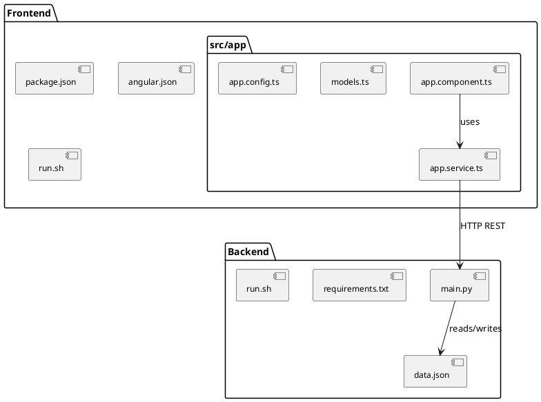

# Todo List with Calendar

Full-stack веб-приложение для управления задачами и календарём. Бэкенд на FastAPI (Python), фронтенд на Angular 17.

## 📋 Содержание

- [Структура проекта](#структура-проекта)
- [Технологии](#технологии)
- [Установка и запуск](#установка-и-запуск)
- [API](#api)
- [Диаграмма структуры](#диаграмма-структуры)

## 📁 Структура проекта

```
proj1/
├── backend/                      # Бэкенд (FastAPI)
│   ├── main.py                   # Основной файл приложения FastAPI
│   ├── requirements.txt          # Зависимости Python
│   ├── run.sh                    # Скрипт запуска бэкенда
│   ├── data.json                 # Хранилище данных (todos + calendar)
│   └── .venv/                    # Python virtual environment
│
├── frontend/                     # Фронтенд (Angular 17)
│   ├── angular.json              # Конфигурация Angular CLI
│   ├── package.json              # Зависимости Node.js
│   ├── tsconfig.json             # Конфигурация TypeScript
│   ├── run.sh                    # Скрипт запуска фронтенда
│   └── src/
│       ├── main.ts               # Точка входа приложения
│       ├── index.html            # HTML шаблон
│       ├── styles.scss           # Глобальные стили
│       └── app/
│           ├── app.component.ts      # Главный компонент
│           ├── app.component.html    # Шаблон компонента
│           ├── app.component.scss    # Стили компонента
│           ├── app.config.ts         # Конфигурация приложения
│           ├── app.routes.ts         # Роуты (если нужны)
│           ├── todo.service.ts       # Сервис работы с TODO
│           ├── calendar.service.ts   # Сервис работы с календарём
│           ├── models.ts             # TypeScript интерфейсы
│           └── app.component.spec.ts # Тесты
```

## 🛠 Технологии

### Бэкенд
| Технология | Версия | Назначение |
|------------|--------|------------|
| FastAPI | ^0.100+ | REST API фреймворк |
| Uvicorn | latest | ASGI сервер |
| Pydantic | ^2.0 | Валидация данных |
| python-multipart | - | Обработка форм |

### Фронтенд
| Технология | Версия | Назначение |
|------------|--------|------------|
| Angular | ^17.0.0 | Фронтенд фреймворк |
| TypeScript | ~5.2.0 | Язык программирования |
| zone.js | ~0.14.0 | Zone polyfill для Angular |

### Зависимости бэкенда (requirements.txt)
```
fastapi
uvicorn[standard]
pydantic
python-multipart
```

### Зависимости фронтенда (package.json)
```json
{
  "@angular/animations": "^17.0.0",
  "@angular/common": "^17.0.0",
  "@angular/compiler": "^17.0.0",
  "@angular/core": "^17.0.0",
  "@angular/forms": "^17.3.12",
  "@angular/platform-browser": "^17.0.0",
  "@angular/platform-browser-dynamic": "^17.0.0",
  "@angular/router": "^17.0.0",
  "rxjs": "~7.8.0",
  "tslib": "^2.3.0",
  "zone.js": "~0.14.0"
}
```

## 🚀 Установка и запуск

### Бэкенд

```bash
# Перейти в директорию бэкенда
cd backend

# Создать виртуальное окружение
python3 -m venv .venv

# Активировать окружение
source .venv/bin/activate

# Установить зависимости
pip install -r requirements.txt

# Запустить сервер
bash run.sh
```

Бэкенд доступен на: `http://localhost:8000`

### Фронтенд

```bash
# Перейти в директорию фронтенда
cd frontend

# Установить зависимости
npm install

# Запустить dev сервер
bash run.sh
```

Фронтенд доступен на: `http://localhost:4200`

## 📡 API

### TODO

| Метод | Endpoint | Описание |
|-------|----------|----------|
| GET | `/api/todos` | Получить все задачи |
| GET | `/api/todos/{id}` | Получить задачу по ID |
| POST | `/api/todos` | Создать новую задачу |
| PUT | `/api/todos/{id}` | Обновить задачу |
| DELETE | `/api/todos/{id}` | Удалить задачу |
| GET | `/api/todos/overdue` | Получить просроченные задачи |

### Calendar

| Метод | Endpoint | Описание |
|-------|----------|----------|
| GET | `/api/calendar/{date}` | Получить событие на дату |
| GET | `/api/calendar/events` | Получить все события |
| POST | `/api/calendar` | Создать событие |
| PUT | `/api/calendar/{date}` | Обновить событие |
| DELETE | `/api/calendar/{date}` | Удалить событие |

## 📊 Хранение данных

Все данные хранятся в файле `backend/data.json`:

```json
{
  "todos": [
    {
      "id": 1,
      "title": "Task title",
      "description": "Task description",
      "due_date": "2026-06-22",
      "completed": false,
      "size": null
    }
  ],
  "calendar": {
    "2026-06-22": {
      "id": 1,
      "title": "Event title",
      "description": "Event description",
      "date": "2026-06-22",
      "start_time": "09:00",
      "end_time": "10:00",
      "size": null
    }
  }
}
```

## 📐 Диаграмма структуры проекта



## 🔧 Конфигурация

### CORS (backend/main.py)
```python
app.add_middleware(
    CORSMiddleware,
    allow_origins=["http://localhost:4200", "http://127.0.0.1:4200"],
    allow_credentials=True,
    allow_methods=["*"],
    allow_headers=["*"],
)
```

### Angular App Config (app.config.ts)
```typescript
export const appConfig: ApplicationConfig = {
  providers: [
    provideZoneChangeDetection({ eventCoalescing: true }),
    provideRouter(routes),
    provideHttpClient()
  ]
};
```

---

Создано для проекта Todo List with Calendar.