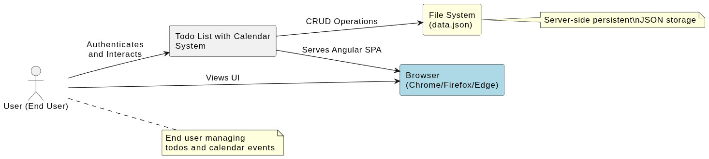
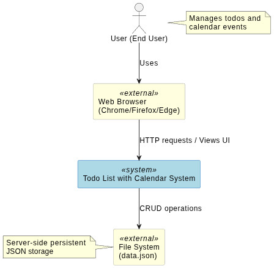
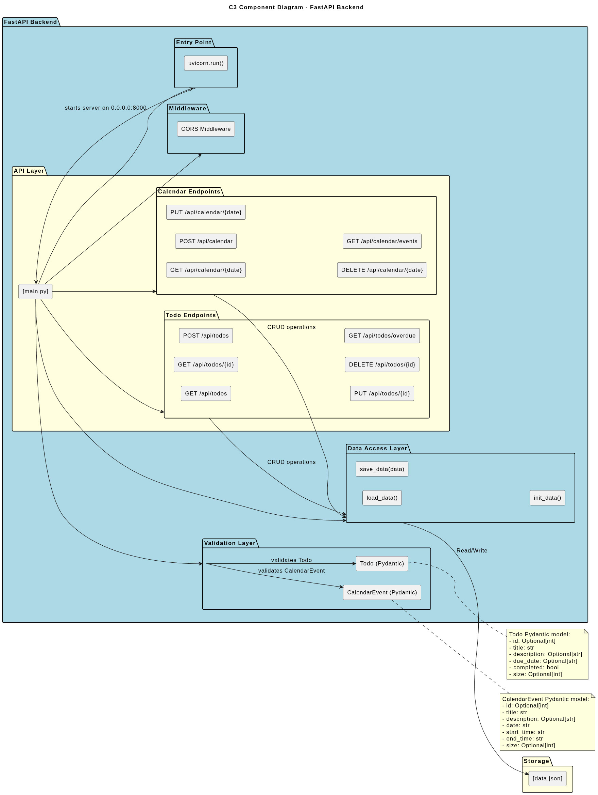
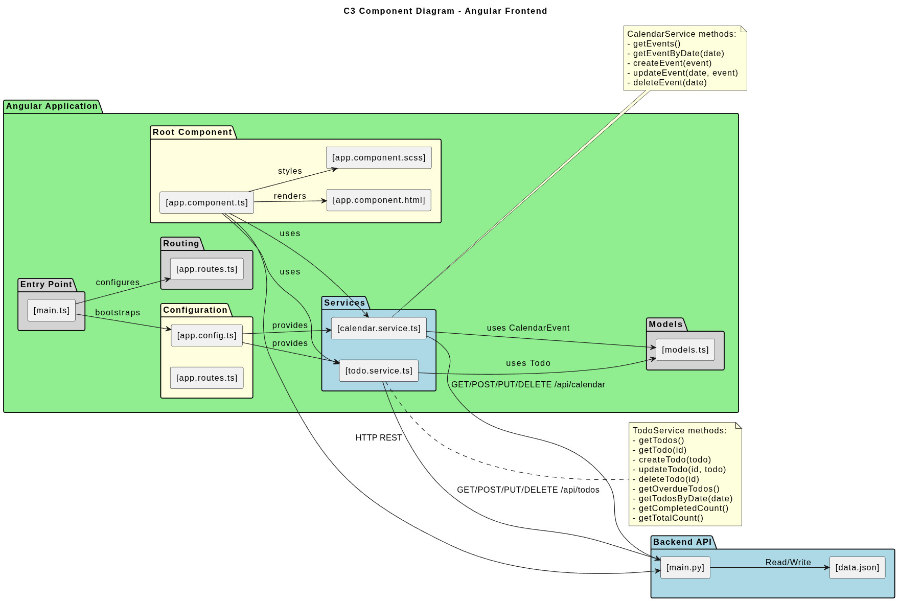
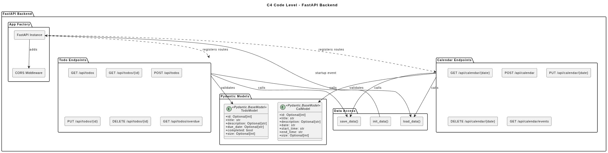
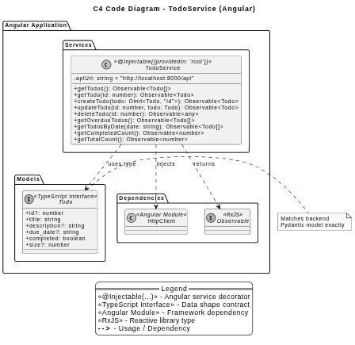
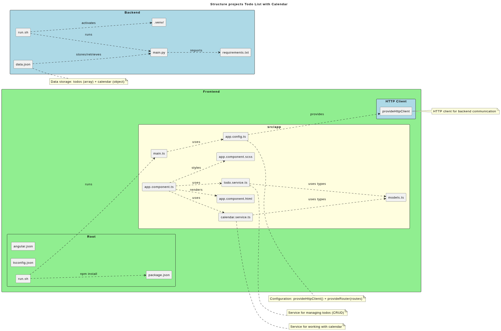

# Todo List with Calendar

Full-stack веб-приложение для управления задачами и календарём. Бэкенд на FastAPI (Python), фронтенд на Angular 17.

## 📋 Содержание

- [Todo List with Calendar](#todo-list-with-calendar)
  - [📋 Содержание](#-содержание)
  - [📁 Структура проекта](#-структура-проекта)
  - [🛠 Технологии](#-технологии)
    - [Бэкенд](#бэкенд)
    - [Фронтенд](#фронтенд)
    - [Зависимости бэкенда (requirements.txt)](#зависимости-бэкенда-requirementstxt)
    - [Зависимости фронтенда (package.json)](#зависимости-фронтенда-packagejson)
  - [🚀 Установка и запуск](#-установка-и-запуск)
    - [Бэкенд](#бэкенд-1)
    - [Фронтенд](#фронтенд-1)
  - [📡 API](#-api)
    - [TODO](#todo)
    - [Calendar](#calendar)
  - [📊 Хранение данных](#-хранение-данных)
  - [C1 — System Context Diagram](#c1--system-context-diagram)
  - [C2 — Container Diagram](#c2--container-diagram)
  - [C3 — Component Diagrams](#c3--component-diagrams)
    - [C3 Backend (FastAPI)](#c3-backend-fastapi)
    - [C3 Frontend (Angular)](#c3-frontend-angular)
  - [C4 — Code Diagrams](#c4--code-diagrams)
    - [C4 Code Backend](#c4-code-backend)
    - [C4 Code TodoService](#c4-code-todoservice)
  - [Структура проекта (визуально)](#структура-проекта-визуально)
  - [🔧 Конфигурация](#-конфигурация)
    - [CORS (backend/main.py)](#cors-backendmainpy)
    - [Angular App Config (app.config.ts)](#angular-app-config-appconfigts)

## 📁 Структура проекта

```
proj1/
├── backend/                      # Бэкенд (FastAPI)
│   ├── main.py                   # Основной файл приложения FastAPI
│   ├── requirements.txt          # Зависимости Python
│   ├── run.sh                    # Скрипт запуска бэкенда
│   ├── data.json                 # Хранилище данных (todos + calendar)
│   └── .venv/                    # Python virtual environment
│
├── frontend/                     # Фронтенд (Angular 17)
│   ├── angular.json              # Конфигурация Angular CLI
│   ├── package.json              # Зависимости Node.js
│   ├── tsconfig.json             # Конфигурация TypeScript
│   ├── run.sh                    # Скрипт запуска фронтенда
│   └── src/
│       ├── main.ts               # Точка входа приложения
│       ├── index.html            # HTML шаблон
│       ├── styles.scss           # Глобальные стили
│       └── app/
│           ├── app.component.ts      # Главный компонент
│           ├── app.component.html    # Шаблон компонента
│           ├── app.component.scss    # Стили компонента
│           ├── app.config.ts         # Конфигурация приложения
│           ├── app.routes.ts         # Роуты (если нужны)
│           ├── todo.service.ts       # Сервис работы с TODO
│           ├── calendar.service.ts   # Сервис работы с календарём
│           ├── models.ts             # TypeScript интерфейсы
│           └── app.component.spec.ts # Тесты
```

## 🛠 Технологии

### Бэкенд
| Технология | Версия | Назначение |
|------------|--------|------------|
| FastAPI | ^0.100+ | REST API фреймворк |
| Uvicorn | latest | ASGI сервер |
| Pydantic | ^2.0 | Валидация данных |
| python-multipart | - | Обработка форм |

### Фронтенд
| Технология | Версия | Назначение |
|------------|--------|------------|
| Angular | ^17.0.0 | Фронтенд фреймворк |
| TypeScript | ~5.2.0 | Язык программирования |
| zone.js | ~0.14.0 | Zone polyfill для Angular |

### Зависимости бэкенда (requirements.txt)
```
fastapi
uvicorn[standard]
pydantic
python-multipart
```

### Зависимости фронтенда (package.json)
```json
{
  "@angular/animations": "^17.0.0",
  "@angular/common": "^17.0.0",
  "@angular/compiler": "^17.0.0",
  "@angular/core": "^17.0.0",
  "@angular/forms": "^17.3.12",
  "@angular/platform-browser": "^17.0.0",
  "@angular/platform-browser-dynamic": "^17.0.0",
  "@angular/router": "^17.0.0",
  "rxjs": "~7.8.0",
  "tslib": "^2.3.0",
  "zone.js": "~0.14.0"
}
```

## 🚀 Установка и запуск

### Бэкенд

```bash
# Перейти в директорию бэкенда
cd backend

# Создать виртуальное окружение
python3 -m venv .venv

# Активировать окружение
source .venv/bin/activate

# Установить зависимости
pip install -r requirements.txt

# Запустить сервер
bash run.sh
```

Бэкенд доступен на: `http://localhost:8000`

### Фронтенд

```bash
# Перейти в директорию фронтенда
cd frontend

# Установить зависимости
npm install

# Запустить dev сервер
bash run.sh
```

Фронтенд доступен на: `http://localhost:4200`

## 📡 API

### TODO

| Метод | Endpoint | Описание |
|-------|----------|----------|
| GET | `/api/todos` | Получить все задачи |
| GET | `/api/todos/{id}` | Получить задачу по ID |
| POST | `/api/todos` | Создать новую задачу |
| PUT | `/api/todos/{id}` | Обновить задачу |
| DELETE | `/api/todos/{id}` | Удалить задачу |
| GET | `/api/todos/overdue` | Получить просроченные задачи |

### Calendar

| Метод | Endpoint | Описание |
|-------|----------|----------|
| GET | `/api/calendar/{date}` | Получить событие на дату |
| GET | `/api/calendar/events` | Получить все события |
| POST | `/api/calendar` | Создать событие |
| PUT | `/api/calendar/{date}` | Обновить событие |
| DELETE | `/api/calendar/{date}` | Удалить событие |

## 📊 Хранение данных

Все данные хранятся в файле `backend/data.json`:

```json
{
  "todos": [
    {
      "id": 1,
      "title": "Task title",
      "description": "Task description",
      "due_date": "2026-06-22",
      "completed": false,
      "size": null
    }
  ],
  "calendar": {
    "2026-06-22": {
      "id": 1,
      "title": "Event title",
      "description": "Event description",
      "date": "2026-06-22",
      "start_time": "09:00",
      "end_time": "10:00",
      "size": null
    }
  }
}
```

## C1 — System Context Diagram



**Описание:** Диаграмма контекста системы (C1) показывает взаимодействие внешних акторов с системой в целом на высшем уровне.

- **User (End User)** — конечный пользователь, который аутентифицируется и взаимодействует с системой
- **Todo List with Calendar System** — основная система в целом
- **Browser (Chrome/Firefox/Edge)** — веб-браузер, через который пользователь получает Angular SPA
- **File System (data.json)** — серверное хранилище данных

**Связи:**
- Пользователь → Система: аутентификация и взаимодействие
- Система → Браузер: выдача Angular SPA
- Система → Файловая система: CRUD-операции
- Пользователь → Браузер: просмотр интерфейса

---

## C2 — Container Diagram



**Описание:** Диаграмма контейнеров (C2) показывает высокоуровневую архитектуру приложения и взаимодействие между контейнерами.

- **User (End User)** — конечный пользователь
- **Web Browser** — внешний контейнер (external), используется для доступа к приложению
- **Todo List with Calendar System** — основная система
- **File System (data.json)** — внешний контейнер хранилища

**Связи:**
- Пользователь → Браузер: использует
- Браузер → Система: HTTP-запросы / просмотр интерфейса
- Система → Файловая система: CRUD-операции

---

## C3 — Component Diagrams

### C3 Backend (FastAPI)



**Описание:** Диаграмма компонентов бэкенда показывает внутреннюю структуру FastAPI-приложения.

**Компоненты:**
- **API Layer** — слой API с эндпоинтами для TODO и Calendar
- **Todo Endpoints** — `GET/POST/PUT/DELETE /api/todos`, `GET /api/todos/overdue`
- **Calendar Endpoints** — `GET/POST/PUT/DELETE /api/calendar`, `GET /api/calendar/events`
- **Validation Layer** — Pydantic модели (Todo, CalendarEvent)
- **Data Access Layer** — функции `load_data()`, `save_data()`, `init_data()`
- **Middleware** — CORS Middleware
- **Entry Point** — uvicorn.run()

**Связи:**
- Эндпоинты → Data Access Layer: CRUD-операции
- Data Access Layer → data.json: чтение/запись
- Pydantic модели: валидация входных данных

### C3 Frontend (Angular)



**Описание:** Диаграмма компонентов фронтенда показывает структуру Angular-приложения.

**Компоненты:**
- **Root Component** — `app.component.ts/html/scss`
- **Services** — `todo.service.ts`, `calendar.service.ts`
- **Models** — `models.ts` (интерфейсы TypeScript)
- **Configuration** — `app.config.ts`, `app.routes.ts`
- **Entry Point** — `main.ts`

**Связи:**
- Компонент → Сервисы: использование
- Сервисы → Модели: использование типов
- Сервисы → Backend API: HTTP REST запросы

---

## C4 — Code Diagrams

### C4 Code Backend



**Описание:** Диаграмма кода бэкенда показывает детализированную структуру FastAPI-приложения на уровне классов.

**Элементы:**
- **Pydantic Models** — `TodoModel` и `CalModel` с полями данных
- **Data Access** — функции `init_data()`, `load_data()`, `save_data()`
- **Todo Endpoints** — REST эндпоинты для TODO
- **Calendar Endpoints** — REST эндпоинты для Calendar
- **App Factory** — FastAPI Instance + CORS Middleware

**Связи:**
- FastAPI → CORS: добавление middleware
- Эндпоинты → Pydantic модели: валидация
- Эндпоинты → Data Access: чтение/запись данных

### C4 Code TodoService



**Описание:** Диаграмма кода TodoService показывает детализированную структуру Angular-сервиса для управления TODO.

**Элементы:**
- **TodoService** — Angular сервис с декоратором `@Injectable({providedIn: 'root'})`
  - `getTodos()` — получить все задачи
  - `getTodo(id)` — получить задачу по ID
  - `createTodo(todo)` — создать задачу
  - `updateTodo(id, todo)` — обновить задачу
  - `deleteTodo(id)` — удалить задачу
  - `getOverdueTodos()` — получить просроченные задачи
  - `getTodosByDate(date)` — получить задачи на дату
  - `getCompletedCount()` — получить количество выполненных
  - `getTotalCount()` — получить общее количество
- **Todo Interface** — TypeScript интерфейс, соответствующий Pydantic модели
- **Зависимости** — HttpClient, Observable (RxJS)

**Связи:**
- TodoService → HttpClient: внедрение зависимостей
- TodoService → Todo: использование типа
- TodoService → Observable: возврат значений

---

## Структура проекта (визуально)



Диаграмма структуры проекта показывает организацию файлов и директорий приложения:
- **Backend** — бэкенд-часть на FastAPI (`main.py`, `requirements.txt`, `run.sh`, `data.json`, `.venv/`)
- **Frontend** — фронтенд на Angular (angular.json, package.json, tsconfig.json, run.sh, src/app/)
- **src/app** — основной код приложения: компоненты, сервисы, модели, конфигурация
- Связи между файлами показывают зависимости и взаимодействие (импорт, запуск, хранение данных)


## 🔧 Конфигурация

### CORS (backend/main.py)
```python
app.add_middleware(
    CORSMiddleware,
    allow_origins=["http://localhost:4200", "http://127.0.0.1:4200"],
    allow_credentials=True,
    allow_methods=["*"],
    allow_headers=["*"],
)
```

### Angular App Config (app.config.ts)
```typescript
export const appConfig: ApplicationConfig = {
  providers: [
    provideZoneChangeDetection({ eventCoalescing: true }),
    provideRouter(routes),
    provideHttpClient()
  ]
};
```
